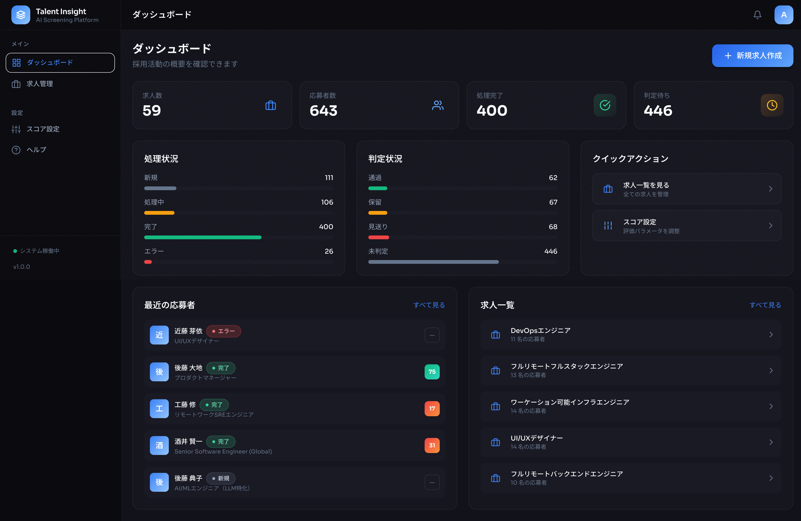
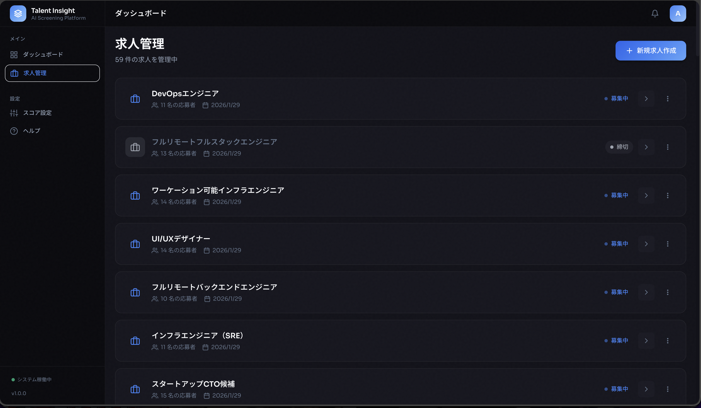
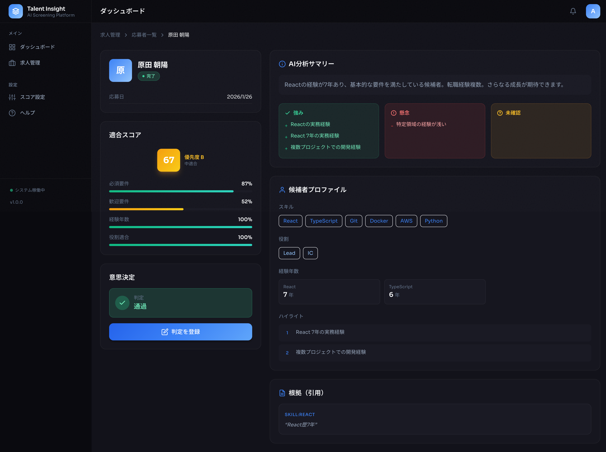

# 採用書類選考支援システム

AIによる書類選考を自動化し、採用担当者の意思決定を支援するシステムです。

## スクリーンショット

### ダッシュボード
採用活動の全体状況を一目で把握できます。



### 求人管理
求人の作成・管理、ステータスの切り替えができます。



### 応募者詳細
AIによる分析結果、スコア内訳、候補者プロファイルを確認できます。



## 概要

### 目的

- 1件あたりのレビュー時間削減
- 書類滞留の削減
- 判断基準の一貫性向上（説明可能な根拠の提示）
- 面談後のミスマッチ低減

### 設計方針

- **AIは合否を確定しない** - 最終判断は人間が行う
- **LLMに直接スコアを出させない** - 構造化抽出のみLLMが担当、スコア算出はアプリ側
- **説明可能性** - すべてのスコアに根拠（evidence）を付与

## 技術スタック

| コンポーネント | 技術 |
|---------------|------|
| Backend API | FastAPI (Python 3.11+) |
| Worker | Python (非同期処理) |
| Frontend | Next.js 14 (App Router, TypeScript) |
| Database | MySQL 8.0 |
| Storage | ローカルボリューム |
| Queue | DBポーリング (jobs_queue) |
| 外部API | OpenAI Responses API, Embeddings API |
| インフラ | Docker Compose |
| Python PM | uv |

## システム構成

```
┌─────────────┐     ┌─────────────┐     ┌─────────────┐
│   Frontend  │────▶│   Backend   │────▶│   Worker    │
│  (Next.js)  │     │  (FastAPI)  │     │  (Python)   │
└─────────────┘     └──────┬──────┘     └──────┬──────┘
                           │                    │
                    ┌──────▼──────┐      ┌──────▼──────┐
                    │  Database   │      │ OpenAI API  │
                    │   (MySQL)   │      │             │
                    └─────────────┘      └─────────────┘
                           │
                    ┌──────▼──────┐
                    │   Storage   │
                    │   (Local)   │
                    └─────────────┘
```

## ディレクトリ構造

```
/workspace/
├── docker-compose.yml      # サービス定義
├── .env.example            # 環境変数テンプレート
├── Makefile                # 開発コマンド
│
├── backend/                # Backend API
│   ├── Dockerfile
│   ├── pyproject.toml
│   ├── alembic/            # DBマイグレーション
│   └── app/
│       ├── main.py         # FastAPIエントリ
│       ├── config.py       # 設定管理
│       ├── api/routes/     # APIエンドポイント
│       ├── models/         # SQLAlchemyモデル
│       ├── schemas/        # Pydanticスキーマ
│       ├── services/       # ビジネスロジック
│       ├── repositories/   # データアクセス
│       └── core/           # 共通機能
│
├── worker/                 # 非同期処理Worker
│   ├── Dockerfile
│   ├── pyproject.toml
│   └── worker/
│       ├── main.py         # ポーリングループ
│       ├── tasks/          # 処理タスク
│       ├── clients/        # OpenAIクライアント
│       ├── extractors/     # テキスト抽出
│       ├── scorers/        # スコア計算
│       └── prompts/        # LLMプロンプト
│
├── frontend/               # フロントエンド
│   ├── Dockerfile
│   ├── package.json
│   └── src/
│       ├── app/            # Next.js App Router
│       ├── components/     # UIコンポーネント
│       ├── hooks/          # カスタムフック
│       └── lib/            # ユーティリティ
│
└── storage/                # ファイルストレージ
    ├── raw/                # 原本ファイル
    ├── text/               # 抽出テキスト
    └── evidence/           # 根拠JSON
```

## セットアップ

### 前提条件

- Docker & Docker Compose
- （任意）OpenAI API キー

### インストール

```bash
# リポジトリをクローン
git clone <repository-url>
cd <repository>

# 環境変数ファイルを作成
cp .env.example .env

# OpenAI APIキーを設定（任意）
# .env の OPENAI_API_KEY を編集
# 未設定の場合、モッククライアントが使用されます

# セットアップと起動（ビルド + マイグレーション）
make setup
```

### 手動セットアップ

```bash
# ストレージディレクトリ作成
make init-storage

# Dockerイメージのビルドと起動
make up-build

# データベースマイグレーション
make migrate
```

## 使い方

### アクセスURL

| サービス | URL |
|---------|-----|
| Frontend | https://app.example.com |
| Backend API | https://api.example.com |
| API Docs | https://api.example.com/docs |

### 基本的なワークフロー

#### 1. 求人を作成

```bash
curl -X POST https://api.example.com/jobs \
  -H "Content-Type: application/json" \
  -d '{
    "title": "Pythonエンジニア",
    "job_text_raw": "【必須】Python 3年以上、AWS経験\n【歓迎】Go、Kubernetes経験"
  }'
```

または、Frontend (https://app.example.com/jobs) から「新規求人作成」

#### 2. 応募者を登録して書類をアップロード

```bash
# 応募者作成
curl -X POST https://api.example.com/jobs/{job_id}/candidates \
  -H "Content-Type: application/json" \
  -d '{"display_name": "山田太郎"}'

# 書類アップロード
curl -X POST https://api.example.com/candidates/{candidate_id}/documents \
  -F "file=@resume.pdf" \
  -F "type=resume"
```

または、Frontend の求人詳細画面から「応募者追加」

#### 3. 処理完了を待つ

アップロード後、Workerが自動的に以下のパイプラインを実行：

```
書類アップロード
     ↓
TEXT_EXTRACT (PDF/Word → テキスト)
     ↓
LLM_EXTRACT (構造化JSON抽出)
     ↓
EMBED (Embedding生成)
     ↓
SCORE (スコア算出)
     ↓
EXPLAIN (説明生成)
     ↓
Candidate.status = DONE
```

処理状況はログまたはFrontendで確認：

```bash
make logs-worker
```

#### 4. 結果を確認

```bash
# 応募者一覧（スコア順）
curl https://api.example.com/jobs/{job_id}/candidates

# 応募者詳細（スコア内訳、根拠、説明）
curl https://api.example.com/candidates/{candidate_id}
```

または、Frontend で確認

#### 5. 意思決定を登録

```bash
curl -X POST https://api.example.com/candidates/{candidate_id}/decision \
  -H "Content-Type: application/json" \
  -d '{
    "decision": "pass",
    "reason": "Python経験が豊富で即戦力"
  }'
```

## スコアリング仕様

### サブスコア（各0〜1）

| スコア | 説明 |
|--------|------|
| MustScore | 必須要件の充足率 |
| NiceScore | 歓迎要件との類似度（Embedding） |
| YearScore | 経験年数の充足率 |
| RoleScore | 役割期待との適合度 |

### 総合スコア（0〜100）

```
TotalFit = round((w_must×MustScore + w_nice×NiceScore + w_year×YearScore + w_role×RoleScore) × 100)
```

デフォルト重み：
- Must: 45%
- Nice: 20%
- Year: 20%
- Role: 15%

### Must Cap

必須要件を1つでも満たさない場合、総合スコアに上限（デフォルト20点）を適用。

### スコア設定の変更

Frontend (https://app.example.com/admin/score-config) または API で変更可能：

```bash
curl -X POST https://api.example.com/admin/score-config \
  -H "Content-Type: application/json" \
  -d '{
    "weights": {"must": 0.5, "nice": 0.2, "year": 0.15, "role": 0.15},
    "must_cap_enabled": true,
    "must_cap_value": 25,
    "nice_top_n": 3
  }'
```

## API リファレンス

### 求人管理

| Method | Endpoint | 説明 |
|--------|----------|------|
| POST | `/jobs` | 求人作成 |
| GET | `/jobs` | 求人一覧 |
| GET | `/jobs/{job_id}` | 求人詳細 |
| PATCH | `/jobs/{job_id}` | 求人更新 |
| DELETE | `/jobs/{job_id}` | 求人削除 |

### 応募者管理

| Method | Endpoint | 説明 |
|--------|----------|------|
| POST | `/jobs/{job_id}/candidates` | 応募者作成 |
| GET | `/jobs/{job_id}/candidates` | 応募者一覧（ランキング） |
| GET | `/candidates/{candidate_id}` | 応募者詳細 |

### 書類管理

| Method | Endpoint | 説明 |
|--------|----------|------|
| POST | `/candidates/{candidate_id}/documents` | 書類アップロード |
| GET | `/candidates/{candidate_id}/documents` | 書類一覧 |
| GET | `/documents/{document_id}/download` | 書類ダウンロード |
| GET | `/documents/{document_id}/text` | 抽出テキスト取得 |

### 意思決定

| Method | Endpoint | 説明 |
|--------|----------|------|
| POST | `/candidates/{candidate_id}/decision` | 意思決定登録 |
| GET | `/candidates/{candidate_id}/decisions` | 意思決定履歴 |

### 設定管理

| Method | Endpoint | 説明 |
|--------|----------|------|
| GET | `/admin/score-config` | 現在のスコア設定 |
| POST | `/admin/score-config` | スコア設定更新 |

## 開発コマンド

```bash
# 起動・停止
make up              # 起動
make up-build        # ビルドして起動
make down            # 停止

# ログ
make logs            # 全サービスのログ
make logs-api        # APIのログ
make logs-worker     # Workerのログ

# データベース
make migrate         # マイグレーション実行
make migrate-generate MSG="変更内容"  # マイグレーション生成
make shell-db        # MySQLシェル

# シェルアクセス
make shell-api       # APIコンテナ
make shell-worker    # Workerコンテナ

# テスト
make test-api        # Backendテスト
make test-worker     # Workerテスト
make test-frontend   # Frontendテスト
make test            # 全テスト

# クリーンアップ
make clean           # ボリューム含めて削除
```

## 環境変数

| 変数 | 説明 | デフォルト |
|------|------|-----------|
| MYSQL_ROOT_PASSWORD | MySQL rootパスワード | rootpassword |
| MYSQL_DATABASE | データベース名 | screening |
| MYSQL_USER | DBユーザー | screening_user |
| MYSQL_PASSWORD | DBパスワード | screening_pass |
| OPENAI_API_KEY | OpenAI APIキー | （空、モック動作） |
| DEBUG | デバッグモード | false |
| ENVIRONMENT | 環境（development/production） | production |
| POLL_INTERVAL | Workerポーリング間隔（秒） | 5 |

### 開発環境でのテストデータ自動投入

`ENVIRONMENT=development` を設定すると、コンテナ起動時にテストデータ（求人50件、応募者500-700名）が自動で登録されます。

```bash
# 開発環境で起動（テストデータ自動投入）
ENVIRONMENT=development docker compose up -d

# 本番環境で起動（テストデータなし）
ENVIRONMENT=production docker compose up -d
# または（デフォルトはproduction）
docker compose up -d
```

## データベーステーブル

| テーブル | 説明 |
|---------|------|
| jobs | 求人票 |
| candidates | 応募者 |
| documents | アップロード書類 |
| extractions | LLM抽出結果 |
| embeddings | Embedding |
| scores | 算出スコア |
| explanations | 説明文 |
| decisions | 意思決定 |
| audit_events | 監査ログ |
| score_config | スコア設定 |
| jobs_queue | 非同期ジョブキュー |

## トラブルシューティング

### Workerが処理を開始しない

```bash
# ログを確認
make logs-worker

# ジョブキューの状態を確認
make shell-db
> SELECT * FROM jobs_queue WHERE status = 'READY';
```

### OpenAI APIエラー

- APIキーが正しく設定されているか確認
- レート制限に達していないか確認
- 未設定の場合はモッククライアントが使用されるため、実際のAI機能は動作しません

### データベース接続エラー

```bash
# MySQLの状態確認
docker compose ps db

# 接続テスト
make shell-db
```

